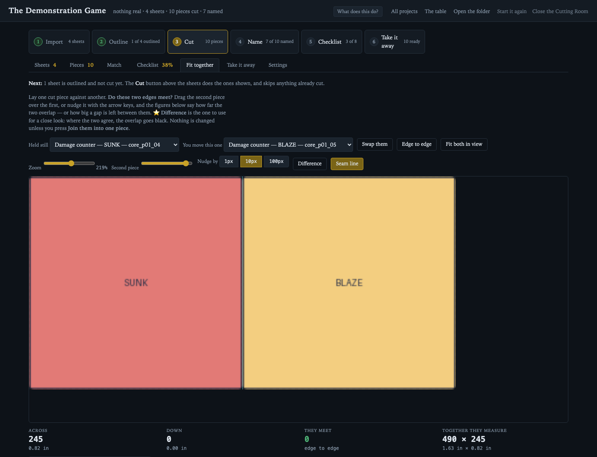
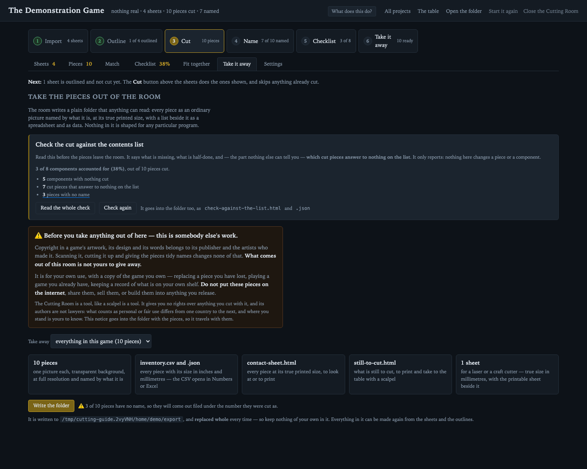
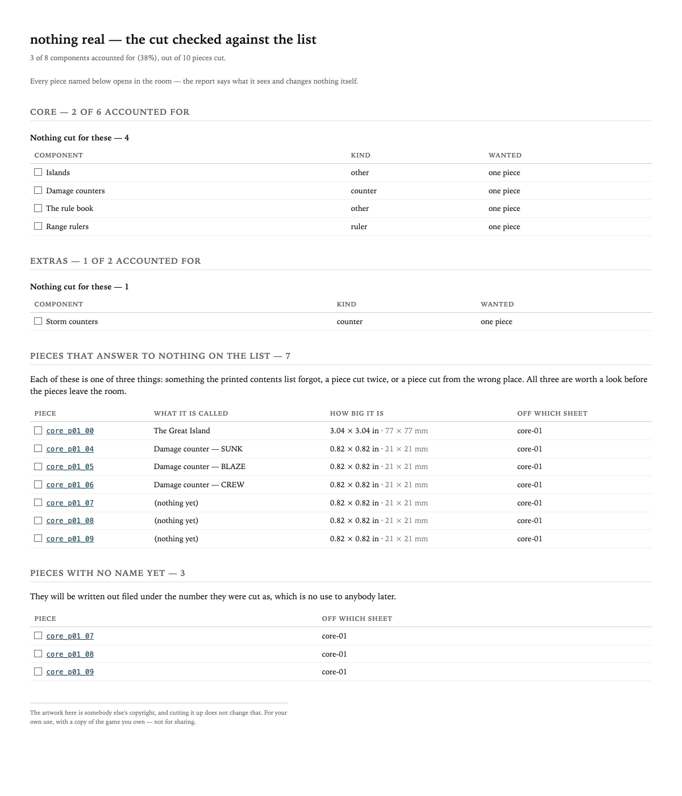

# The Cutting Room — how to use it

You have a board game, or the scans of one. You want each counter, card, tile
and template as its own picture, cut out cleanly, the right size, with a list
saying what each one is.

That is what this does. At the end you have **an ordinary folder**: one picture
per piece on a transparent background, named by what the piece is, at its true
printed size, with a spreadsheet beside it. Nothing in that folder is shaped
for any particular program — it is as much use to somebody making a Tabletop
Simulator mod as to somebody reprinting one lost counter at the right size.

There is one thing the room cannot do for you, and it is the slow part:
**drawing round each piece**. Everything else it does in one press.

---

## ⚠️ Read this part first

**What you cut is somebody else's work.** Copyright in a game's artwork, its
design and its words belongs to its publisher and to the artists who made it.
Scanning it, cutting it up and giving the pieces tidy names changes none of
that. **Nothing that comes out of this room is yours to give away.**

It is for your own use, with a copy of the game that you own — replacing a
piece you have lost, playing a game you already have, keeping a record of
what is on your own shelf.

> Do **not** put the pieces on the internet.
> Do **not** share them, sell them, or build them into anything you release.
> Do **not** upload them to a mod workshop, a file host or a forum.

The Cutting Room is a tool, like a scalpel is a tool. It gives you no rights
over anything you cut with it, and its authors are not lawyers: what counts as
personal or fair use differs from one country to the next, and where you stand
is yours to know. The same notice goes into every folder you export, so it
travels with the pieces.

---

## Opening it, and closing it

Double-click **Cutting Room** on the Desktop and the room opens in your
browser. Nothing else appears — no terminal window, nothing in the Dock.
Press it again whenever you want the room back.

If there is no such icon yet, open Terminal once and run:

```sh
python3 cutting_room.py --install-launcher
```

That puts the launcher on your Desktop, pointed at wherever this copy lives.
After that you never need Terminal again.

**To close it**, press **Close the Cutting Room** at the end of the top bar of
any page. It checks first that nothing is half-written — an import running, a
cut running, or a cutting table open in another tab with an edit not yet
saved — and tells you what it is waiting for. The page it leaves behind says
the room is closed and how to open it again.

**To start it again** — after the room has been updated, or whenever anything
seems stuck — press **Start it again**, next to it. The room stops and comes
straight back in the same window at the same address, and the page you were
on reloads itself when it does. It asks the same question closing asks, and
it reads the new code before letting go of the old room, so it cannot leave
you with no room at all.

⚠️ Do not just close the browser tab and walk away while something is still
being written. That is what the button is for.

---

## The six steps

They run left to right across the top of every page, and each one lights up as
you get to it.


---

### 1 · Get the scans in

**Start a game** on the front page, give it a name, and say where it lives.

Then get the pictures in. You can:

- **drop a PDF anywhere on the window** — every page becomes a sheet;
- **drop a whole folder of scans** on it;
- **drop single pictures** on it;
- or paste a web address.

Scan at **300 dots per inch** if you have the choice. The room works out every
piece's true printed size from that number, so a wrong one makes every
measurement wrong. You can correct it later, per game.

Sheets arrive named after the file they came from, and the room groups them by
what comes before the number — so `plague-01` … `plague-30` are one box, and
`core-01` … `core-40` another. That grouping is used everywhere, because a game
is worked through **a box at a time**, not a sheet at a time.


The chips above the list — *All*, *To outline*, *Cut*, *Finished with* — narrow
it. It opens on **To outline**, which is the work still to do, and it remembers
which one you chose for each game.

---

### 2 · Draw round each piece

This is the slow part and the only part that is really yours to do.

Press **Outline** on a sheet and the cutting table opens: the sheet, big, with
tools down the left.


- **Rectangle** and **Ellipse** — drag a box or an oval round a piece.
- **Outline** — click round an awkward shape point by point, then close it.
- **Adjust** — drag any point of a shape you have already drawn; drag a line
  between two points to add one.
- **Array** — for a block of counters printed on a regular grid: draw one, say
  how many across and down, and it repeats.
- ⭐️ **Add the suggested outlines** — the room's own attempt, from the
  colours. Worth pressing first on any sheet: most of what a box holds is a
  plain rectangle or a plain circle, and where a piece really is one it comes
  back with **four straight corners** (squared up even if the scan was a
  little crooked) or as a true circle, so there is nothing left to tidy.
  Anything else it traces as a curve and leaves you to correct — and it will
  not manage an island with a lagoon in it, which is what the rest of these
  tools are for. ⭐️ It throws its own rubbish away first: anything too small
  or too thin to be a piece of a board game never reaches you.
- ⭐️ **Mask off** — for the part of a sheet that is not components at all: a
  page of printed rules, a title panel, the shadow down one edge of the scan.
  Drag a box over it and the automatic pass leaves that part alone. ⚠️ Nothing
  is deleted and nothing is cropped — you can still outline in there by hand,
  and clicking the box takes it off again.

Your work is saved **to the game's folder, a moment after every change**. There
is no Save button and there does not need to be one.

⚠️ **The letter keys are tools**, so pressing R gets you the rectangle. That
stops the moment you click into a box that expects typing, so naming a piece
does not go rummaging through the toolbox on the way past.

⭐️ **Three keys for the three things you do most to a piece you have chosen:**
`+` lays another copy of it down beside it, ready to be dragged where it
belongs; `X` takes it off the sheet; and `O` hides every *other* outline so you
can work on this one alone without grabbing its neighbour by mistake. `O` again
brings them back, and `⌘Z` puts back anything the other two did.

⭐️ **Keep the shape** puts an outline you have drawn on a shelf, and you can
lay it down again on any other sheet — in this game or any other. A door drawn
once for one dungeon game is the same door in the next.

---

### 3 · Cut

**Cut this sheet** on the sheet, or **Cut the sheets waiting here** above the
list for a run of them.

⭐️ **That button only ever does the work that is left.** It skips sheets you
have already cut, and it acts on the sheets **shown** — so narrow the list
first, by box or by search or with the filters, and it does just those. It
says both on its own face: how many it will cut, how many it is skipping, and
how many are waiting that this list is not showing.

Each piece comes out as its own picture: full resolution, transparent
background, the edge smoothed and bitten very slightly *inside* the printed
line so the die-cut line does not show, and measured in inches.

That is the whole of this step. It takes a second or two a sheet.

⭐️ **You can cut a sheet again as often as you like.** If you fix an outline
and cut again, the names you have already given the pieces **follow them** —
even when adding one outline near the top renumbers everything below it.

⭐️ **Mending one piece cuts that piece.** Follow *mend it at the table* from a
piece on the **Pieces** page: the table opens with that outline in hand and the
button reads **Cut this piece**, so the rest of the sheet is left alone. On a
big scan that is the difference between a second and a minute.

---

### 3½ · Do these two pieces fit together?

⭐️ Two questions the pictures alone can answer, and **Fit together** is the tab
for both. Choose two cut pieces and they are laid edge to edge.

- *Do these two corridor tiles interlock?* Zoom in on the seam and look. The
  **Difference** control turns everything the two agree about black, so a few
  pixels out is obvious in a way it never is by eye. **Nothing is changed.**
- *Are these two halves of one board, scanned across two pages?* Slide the
  second until the overlap registers, name it, and press **Join them into one
  piece**. ⚠️ The two halves are **set aside, not deleted** — the Pieces page
  puts them back.



---

### 4 · Say what each piece is

A picture of a counter is no use later if nothing says which counter it is. And
this, not the cutting, is where the evening goes: what a piece is *called*
comes from a rulebook or a list, not from the piece.


The **Pieces** tab shows every piece at its true printed size on a one-inch
grid, with a box for its name and one for what sort of thing it is.

Things that make it quicker:

- ⭐️ **Choose several at once.** Tick the box above the list and every row
  gets a tick box, with *all shown* and *none* beside it. Tick a whole deck,
  choose the component once, and **Apply to the ticked pieces** gives them all
  the same one. A name you typed yourself is never overwritten.
- ⭐️ **The room offers a kind** — *"looks like a counter, 0.63 × 0.63in"* —
  worked out from the piece's printed size, and one press takes a whole run of
  them. Where a measurement does not settle it, it says nothing at all, which
  is the right answer more often than any particular kind is.
- ⭐️ **⏎ in the name box** saves and moves to the next piece. The arrow keys
  move between pieces too.
- ⭐️ **Match** is the fastest way if you have typed the box's contents list:
  a board of every piece beside the list of components, and you drag a name
  onto the piece it is.
- ⭐️ **Put `deck` in a line's Kind box** and the checklist counts it against
  its full quantity by itself — *0 of 32*, not *not yet* — because a deck of
  thirty-two cards is thirty-two different cards. The row says *counted as a
  deck*, and **one is enough** still overrules it.
- ⭐️ **A deck stays on that list until it has all its cards** — reading
  *3 of 24* as you go — while a counter printed twenty-six times leaves on the
  first piece, because one of it is the whole of it. Each such component also
  carries an **its back** row: drag that onto the piece which is the back and
  every card in the deck points at it, including the ones you link afterwards.
- ⭐️ **The chips above the list** narrow it to the work: *No name*,
  *Look-alikes*, *Worth a look*, and **Held back** — the pieces you have
  marked as not ready yet, each row carrying the reason you gave. An empty
  list always says which empty it is, because for these lists nothing is
  usually the good answer.


**Other things a piece can carry**, all optional:

- **Its back** — a card's back is *another piece*. Cut the back once and point
  every card in the deck at it. ⭐️ Set that back piece's **Kind** to *card
  back* and the list stops offering you all two hundred pieces.
- **How many the game needs** — for one design used over and over, like the
  one card that appears twenty times in a deck. You still cut it **once**, and
  the checklist counts it: a deck of thirty-two made of thirteen designs then
  reads as full rather than *13 of 32*.
- **Turn it** — which way up the piece is handed over, applied everywhere it is
  shown. Quarter turns for a piece printed sideways, and **any angle at all**
  for one cut a little crooked: drag the picture itself, or nudge it by a tenth
  of a degree. A crooked piece has **already been levelled** — the room measures
  the angle off the piece's own edges as it cuts it — and the grid under the
  piece lights up brass to say so. Pieces with no straight edge, like a round
  counter, have no angle to level and the room says nothing about them.
  The picture on disk is never rewritten, so you can change your mind for ever.

---

### 5 · Check what you have against the box

Optional — cutting works perfectly well without it — but it is how you know
when you are finished.


Press **Paste the contents list** and type in the box's own contents list, one
component to a line:

```
26 Damage counters
Turning template x2
Long range ruler
9 | Large templates | template
```

Against each component the room then says **cut**, **probably cut** (a name
matches, but nothing is joined up — press *Confirm the likely links*) or **not
yet**, and gives you a percentage.

⭐️⭐️ **No contents list? Learn it from the pieces.** Most games' lists are
not typed out anywhere, and typing one is the dullest hour in the job. Press
**Learn it from the pieces** and the room gathers everything you have cut into
groups of the same size and design — *"6 pieces, 4 different designs, 0.84 ×
0.84 in, looks like a counter"* — and you give each group **one name**. Each
becomes a line of the checklist with its pieces already tied to it. A group you
do not name is not added; the room cannot know what a piece is called and does
not guess.

⭐️ **A game is a box and its supplements, so there is a figure for each.**
Every section of the list carries its own — *12 of 30 · 40%* — and **+ Add a
set** starts a new section, offering the boxes of sheets you have imported by
name. A box you are **not cutting yet** takes **Put by for later**, on its
heading here or on the Sheets page: its sheets leave the work still to
outline, and its components leave the figure at the top, which is the point —
a percentage that counts work you have decided not to do can never reach 100.
Nothing is deleted, and the line under the figure says what it left out.

⭐️ **And a box you have FINISHED takes File this set away**, on the same
heading. It goes on counting as done — that is the whole difference between
the two marks — but it stops filling the sheet list and the dropdowns with
work there is nothing left to do about. The room offers it by name the moment
every sheet is ticked and every piece named. The **Filed away** chip on Sheets
brings it back, and so does typing a sheet's name in the find box.

⭐️⭐️ **One line, one piece — unless every one is different.** A sheet prints
twenty-six identical damage counters and the game repeats one for ever, so *26
Damage counters* wants **one** piece cut. But *24 Damage cards* is twenty-four
different pieces of card. Nothing in a printed contents list tells those apart,
so each line has an **all different** tick and only you can set it. Until you
do, a deck of thirty-two counts as done the moment you cut one card of it.

---

### 6 · Check the cut, then take it away

On **Take it away**, above the button, is the last thing to read before the
pieces leave: **the cut checked against the contents list**. It changes
nothing; it just tells you what it sees.



**Read the whole check** opens it as a page you can print and work through with
the box open in front of you. ⭐️ **Every piece it names is a link** — press one
and the room opens the Pieces page on that piece, so a finding is something to
go and deal with rather than a name to hunt for.



It says, set by set:

- **components with nothing cut** — the plain gaps;
- **not enough cut yet** — *Damage cards, 24 of 32*;
- **counted only because a name looks right** — a guess, and it says so;
- ⭐️⭐️ **decks the list counts as a single card** — read this one first, or
  the percentage above it is flattering you;
- ⭐️ **cut pieces that answer to nothing on the list** — the one nothing else
  can tell you. Each is either something the printed list forgot, a piece cut
  twice, or a piece cut from the wrong place, and each says **how big it is**,
  which is very often the whole answer;
- **pieces with no name**, **held back**, and **set aside**. ⭐️ The first two
  counts are **links**: press one and the Pieces tab opens with just those
  pieces in front of you.

⭐️ **Take away** above the button offers the whole game or **one set of
sheets** — a box, a supplement, whichever you want on its own. A set goes into
a folder of its own, so taking one never touches another.

Then press **Write the folder**. You get:

| | |
|---|---|
| `pieces/` | one picture per piece, transparent background, named by what it is |
| `inventory.csv` | the same list as a spreadsheet — opens in Numbers or Excel |
| `inventory.json` | the same list again, for a program to read |
| `contact-sheet.html` | every piece at true printed size on one page, to print |
| `still-to-cut.html` | the checklist, to print and take to the table |
| `check-against-the-list.html` | the check above, to read and print |
| `laser/` | cut files for a laser or craft cutter, true size in millimetres |
| `README.txt`, `COPYRIGHT.txt` | what is in the folder, and the notice above |

⚠️ The folder is **replaced whole** every time, so keep nothing of your own in
it. Everything in it can be made again from the sheets and the outlines.

---

## Nothing is ever thrown away

Two things are worth knowing before you press anything that sounds final.

⭐️ **Setting a piece aside does not delete it.** There are two identical ice
fields on the sheet and the game only needs one — so the second is *moved* to a
spare folder, keeps its name, stays in the list dimmed and marked, and comes
back in one press. The hand-over does not look inside that folder, so it simply
is not handed over. Deleting a whole sheet is the only thing in the room that
really deletes, and it says so plainly first.

⭐️ **The room keeps its own history.** Three things in a game cannot be rebuilt
from the scans: the **outlines** you drew, the **names** you gave the pieces,
and the **checklist**. Every time one of those is written, the room keeps the
copy it replaced — the last sixty of each. **Settings** lists them, says what
was in each, and puts one back; the copy it replaces is kept too, so restoring
is not a one-way door either. You do not have to remember to do anything.

---

## When something looks wrong

**A button says "no such call".** The room is running older code than the page
in front of you — this happens when the room has been open while it was
updated. Close it and open it again. A banner across the top says so when the
room notices it itself.

**Something you just did does not show.** Everything saves a moment after you
change it. If a count looks stale, move to another tab and back.

**You lost something.** Look in **Settings → if something goes wrong**. The
outlines, the names and the checklist all keep their last sixty copies.

**You do not know what a button does.** Point at it — every button, link and
box in the room carries a plain sentence saying what will happen. Or press
**What does this do?** at the top, and the room writes them all out under the
controls at once.

---

## Where to read more

- **[ROOM.md](ROOM.md)** is the full reference — every screen, every button,
  every corner of the room. This guide is the walk-through; that is the manual,
  and where the two ever disagree, believe ROOM.md.
- **[README.md](README.md)** is the short public description of the tool.
- **[BACKLOG.md](BACKLOG.md)** is what is built, what is next and what is known
  to be missing.

---

*The pictures in this guide are of a **demonstration sheet** drawn by the tool
itself out of nothing — no game's artwork appears anywhere in this repository.
Re-make them with `docs/make_guide_pictures.sh`.*
