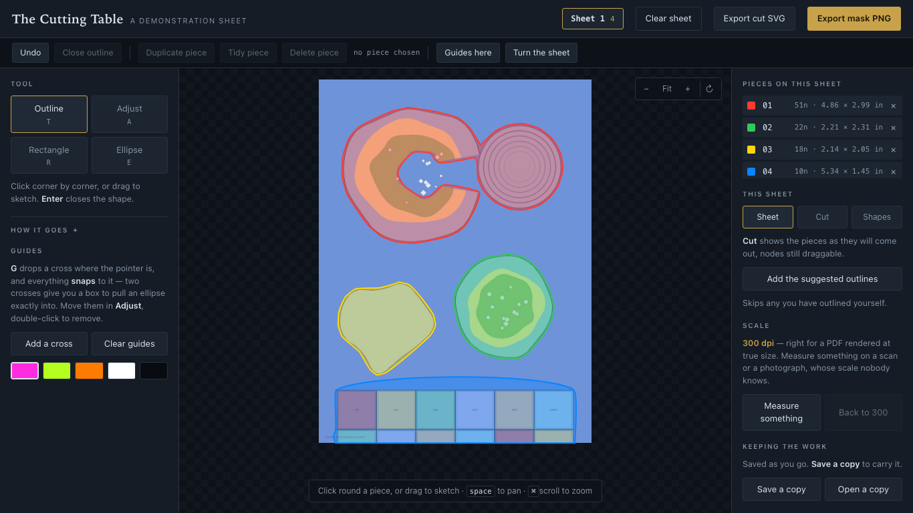
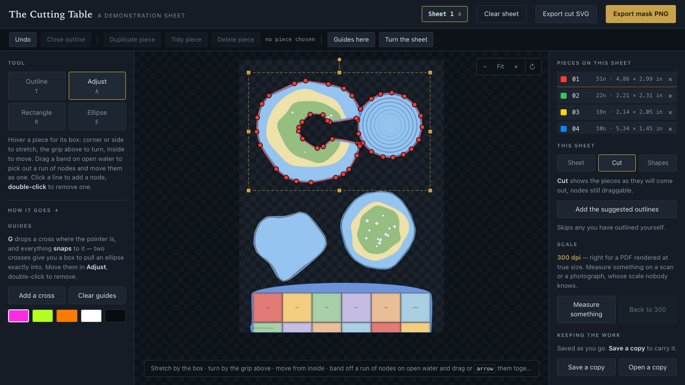

# The Cutting Table

Cut the components out of a scanned board game — counters, cards, terrain,
tiles — at their real printed size, by drawing each outline once in the
browser, and know how much of the game is still to cut.



## ⚠️ Before anything else: what you cut is not yours

Copyright in a board game's artwork, its design and its words belongs to its
publisher and to the artists who made it. Scanning it, cutting it up and
giving the pieces tidy names changes none of that. **Nothing that comes out
of this tool is yours to give away.**

Use it on a copy of a game **you own**, for **your own use** — replacing a
piece you have lost, playing a game you already have, keeping a record of what
is on your own shelf. Do not put cut pieces on the internet, share them, sell
them, or build them into anything you release.

This tool is a scalpel. It gives you no rights over anything you cut with it,
and its authors are not lawyers: what counts as personal or fair use differs
from one country to the next, and where you stand is yours to know. The same
notice is written into every folder the room exports, so it travels with the
pieces.

## Two ways to use it

### The Cutting Room — the whole workshop

```sh
./cutting_room.py --open
```

A local web app on `127.0.0.1`. Nothing is fetched over a network and no scan
leaves the machine.

1. **Import** — drop a PDF, a scan, a Word file with the pictures inside it, a
   ZIP, or **a whole folder** anywhere on the page. Every page becomes a sheet
   at 300 dpi.
2. **Outline** — the editor below, served, saving your work to disk as you
   draw. On cards and counters, *Add the suggested outlines* usually does the
   whole sheet.
3. **Cut** — one press a sheet. Every piece comes out at full resolution, edge
   smoothed and bitten slightly inside the printed die-cut line, measured in
   inches.
4. **Name** — each piece at its printed size on a one-inch grid. Or drag a
   component's name from your checklist straight onto the piece it is. The
   room **offers a kind** rather than asking for one, judged on the piece's
   printed size and shape — 2.5 × 3.5in is a playing card whatever the game —
   and one press takes a whole run of them: *call these 42 counters*. It says
   nothing at all about the shapes a measurement cannot settle.
5. **Check** — the checklist is the game's own contents list, with *cut* /
   *probably cut* / *not yet* against every component, and a percentage. When
   the cutting is done there is **a report to read once**: what is missing,
   what is half-done, which components are counted only on a guess, and — the
   part nothing else can tell you — **which cut pieces answer to nothing on
   the list**. It reports and never fixes.
6. **Take it away** — a plain folder anything can read: every piece as an
   ordinary picture named by what it is, an inventory as a spreadsheet *and* as
   data, a page of every piece at true printed size, the checklist to print,
   the check above as a page **and** as data,
   and **cut files for a laser or a craft cutter** at true size in millimetres
   with the printable sheet beside them. Nothing in it is shaped for any
   particular program — which is the point.

After the cut it tells you what it noticed: pieces with no name, pieces that
run off the edge of the sheet, and **pieces that look like each other** — a
component sheet prints twenty of a counter and only one is wanted, so it lays
the set side by side and offers to keep one. **Every one of those can be
answered**, including by saying it does not matter, so the list of things to
look at is one you can actually empty.

**[GUIDE.md](GUIDE.md) is the walk-through**, with pictures — start there.
**[ROOM.md](ROOM.md) is the full manual.**

### The Cutting Table — the editor on its own

```sh
./cutting_table.py --pdf components.pdf --pages 3,5,7 --draft \
    --subject "A game · card terrain" --out ~/Desktop/Cutting.html
```

Bakes the sheets and the whole editor into **one self-contained HTML file**
that opens from disk with the wifi off. That is the original tool and it still
works exactly as it did. ⚠️ It keeps your outlines in the browser and the way
out is the *Save a copy* button — the room exists partly because that is one
button too many to have to remember.

## Why it is done by hand

Because doing it automatically does not work, and cannot be made to.

The obvious approach is to flood the flat colour the sheet is printed on,
inwards from the border, and call everything the flood never reached a
component. On most sheets that is fine. On any sheet where a piece has
the *same* colour painted inside it, it fails badly: the sea inside an
island is the same blue as the sheet the island is printed on, so the
flood walks in through a lagoon and cuts the piece in half.

Everything else was tried too. Keying out the blue eats the surf and the
shoreline. Flooding up to detected dark lines leaks, because the interiors
are smooth. Creeping inward from the flat field gives ragged edges. And
the die-cut line *is* visible in a good scan — a fine dark hairline, found
with a morphological black-hat — but it vanishes wherever it crosses dark
artwork, so there is never a complete curve to trace.

So: the outline is drawn by hand, once, and everything either side of that
is automatic. The colour flood still earns its keep — it drafts a first
attempt for every piece it can find, and correcting a shape is much less
work than drawing one.

## What it is

**`cutting_room.py`** is the server and the four pages round the editor:
projects, importing, cutting, naming, and the checklist. Standard library plus
numpy and Pillow — no framework, no build step, nothing to install beyond what
the cutting itself needs. It has to start from a double-clicked file on a
machine with nothing on it.

**`cutting_table.py`** bakes your sheets into a single self-contained HTML
file — the sheets, the drafted outlines and the whole editor, with nothing
fetched over a network. It opens from disk with the wifi off, which is the
point: this is work you do on a train.

**The page itself** is where the outlines are drawn. Click your way round a
piece corner by corner, or drag to sketch freehand, or drag out a
rectangle or an ellipse. Nothing closes until you close it, so letting go
of the mouse costs nothing. Then adjust: drag a node, band off a run of
nodes and move them together, stretch or turn the whole piece by its box.
Guides snap. A **Cut** view throws away everything outside your outlines so
you can judge a piece as it will come out, while still dragging its nodes.

**A shape can be kept and used again.** Some games are printed on one die:
every door the same rectangle, every room tile the same square. Outline one,
press **Keep this shape**, and it goes on a shelf with a small drawing of it
and its printed size; pick it up and each click lays another one down. A kept
shape is stored in **inches**, not in one sheet's pixels, so it lands at the
same true size on a sheet scanned at any resolution — and in any game. The size
is an offer, not a rule: type another, or drag the shape out on the sheet, and
it scales without changing shape.

⭐️ **And a kept shape is a ruler.** A sheet from an expansion, a fan PDF or a
scanned magazine is at whatever scale it happens to be at, so a piece cut from
it comes out a few per cent wrong — which shows the moment it sits on the board
beside a core-box piece. Outline the one piece on it you *know* the true size
of, press **Scale the sheet to this shape**, and the room works that sheet's
real dots-per-inch back from the two sizes. Every measurement on the sheet is
then in the game's own units, and shapes laid on it afterwards are identical to
the ones from the box the shape came out of. A cut piece can be kept as a shape
too, from the Pieces step, since the outline that made it is still on file. The
shelf is shared: it lives beside the projects rather than inside one, the list
shows the shapes **starred for the game you are in**, and the search box
reaches every game's, so a door drawn for one box can be brought over to
another. (Offline, the baked page keeps its shelf in the browser and has no
stars, there being no project to star them for.)

A piece can also be **named**, with a note beside it. An outline says
where to cut and nothing about what has been cut, and a thumbnail is a
poor way to tell one counter from another later on. The name is kept with
the outline and travels in the exported JSON, so whatever picks the pieces
up afterwards knows what each one is.

Sheets can also be **added to a baked page** — a scan that turned up late,
a page from another box — without rebuilding it. The picture goes into
IndexedDB, or into localStorage when there is no IndexedDB to be had,
which is the case for a page opened straight off the disk in Chrome. That
store is small, so a picture kept there is shrunk until it fits and the
page says so; outlines are measured against the sheet and everything
downstream scales them, so it costs a little accuracy and nothing else.

Each sheet has a **finished with it** tick, which puts a ✓ on its tab. It
is set by hand, on purpose: the tool will not guess from how many outlines
a sheet has, because ten outlines may be a finished sheet or half of one.

Another page can send someone straight to a particular outline:
`#<sheet-id>` opens that sheet, and `#<sheet-id>/<piece number>` opens it
with that piece chosen and the view brought round to it. Useful when
whatever consumes the cut pieces wants to say "this one came out wrong".

It exports three things. A **mask layer** — one flat colour per piece on
transparency, at the sheet's exact pixel size — which is what `cut.py`
reads. A **cut file**: an SVG of the same outlines at true physical
size, in millimetres, one closed path per piece, curved pieces as the
same Béziers that were on screen. Each piece keeps its colour, which is
how LightBurn sorts a cut into layers, so a laser gets them already
sorted. And **all the outlines at once**, as JSON — every sheet, with the
names — which is the thing to keep, because everything else can be rebuilt
from it.

**`cut.py`** reads the sheet and that mask and writes each piece to its own
PNG at full resolution, with a smoothed edge pulled slightly inside your
outline so the printed die-cut line cannot show on the finished piece. It
records each piece's real size in inches in a manifest, because a
component is used at its printed size, never at whatever pixel count it
happens to have.

## Try it without owning anything

⚠️ There is not yet a one-press demo inside the room — it is the first thing on
[BACKLOG.md](BACKLOG.md). What there is:

There is a pretend sheet in `demo/`, drawn from scratch so this repository
never needs anyone else's artwork in it. It is deliberately awkward in the
one way that matters: the water inside the big island is the same colour as
the sheet, with a channel opening to the sea. Draft outlines on it and you
can watch the colour flood cut that island in half — which is the whole
argument above, in one picture.

```sh
./demo/make_demo_sheet.py
./cutting_table.py --images demo/demo-sheet.png --draft --prefix demo \
    --subject "A demonstration sheet" --out ~/Desktop/Cutting.html
```



## Using it

Needs Python 3.9+ with `numpy` and `Pillow`, and `pdftoppm` (poppler) if you
are starting from a PDF. On a Mac the system `/usr/bin/python3` has numpy and
Pillow already; `brew install poppler` supplies the rest.

```sh
# the whole workshop
./cutting_room.py --open
```

On a Mac, make a launcher once and forget the command line:

```sh
./cutting_room.py --install-launcher     # writes "Cutting Room.command" to the Desktop
```

Double-click it to open the room; press **Close the Cutting Room** at the top
of any of its pages to stop it, or **Start it again** to stop and restart it
in the same window — which is how the room picks up its own updates without
anybody going near a terminal. Neither will act over the top of a running
import or a table with an edit that has not reached the disk: they say what
they are waiting for and let you decide.

Or the editor on its own:

```sh
# bake the sheets into an editor, drafting outlines to correct
./cutting_table.py --pdf components.pdf --pages 3,5,7 --draft \
    --subject "A boxed game · card terrain" --out ~/Desktop/Cutting.html

# or from images you scanned yourself
./cutting_table.py --images scans/*.png --draft --subject "A dungeon game"
```

Open the file, correct the outlines, export a mask per sheet, then:

```sh
./cut.py --sheet scans/sheet-05.png --mask masks/sheet-05.png --out cut/
```

### At the table

| | |
|---|---|
| `T` | outline — click corner by corner, or drag to sketch |
| `A` | adjust — nodes, the transform box, whole-piece moves |
| `R` `E` | rectangle, ellipse — hold shift for a square or circle |
| `Enter` | close the outline you are drawing |
| `G` | drop a cross of guides; everything snaps to them |
| `V` | step through sheet / cut / shapes |
| `[` `]` | turn the sheet a quarter, to fit a wide screen |
| `S` | lay a kept shape down — one click each, or drag out a size |
| `⌘D` | duplicate a piece, for a shape that repeats off-grid |
| `⌘Z` | undo, sixty steps deep |
| `esc` | abandon what you are drawing, or leave the scale alone |

Work is kept in the browser as you go, and **Save a copy** writes a JSON
file you can carry to another machine.

### Two things that matter for accuracy

**Colours are identity.** The cutter tells pieces apart by the colour they
were drawn in, so two *touching* pieces of the same colour would come out
as one. The editor never gives out a colour already in use, and picks the
furthest-away one when it has to repeat.

**Scale comes from the render, not the pixels.** A PDF at true size
rendered at 300dpi is correct by construction. A photograph or a scan at
unknown scale is not — every piece will be a few per cent out, which shows
the moment you try to cut card to fit a real board.

So a sheet can be told its own scale. **Measure something** in the Scale
panel, drag a line across anything on the sheet whose real length you
know, and type the length; every size the tool quotes is then anchored to
it — the piece list, the repeat steps, and the cut file. It is kept with
that sheet's outlines and travels in a saved copy.

## It explains itself

Every button, link and box carries a plain sentence saying what it does. Point
at one and the sentence appears beside it; press **What does this do?** at the
top of the page and they are all written out underneath their own controls, for
a touch screen or for anybody who would rather read than poke. It is one
attribute in the markup — `data-tip`, or an ordinary `title` — and `check.sh`
fails on a button that carries neither, which is what stops the next
unexplained control rather than the last one.

## Checking it still works

```sh
check/check.sh
```

Four hundred and fourteen checks, about a minute. It makes a throwaway game out of the
demonstration sheet — in a registry of its own, so nothing you are working
on is touched — and drives a real browser over it: draws a piece, names it,
cuts it out, and looks on disk to see that the piece arrived at the printed
size it should be. Python with Pillow and
numpy, Node 22 or later, and Chrome; without the last two it parses what it
can and says what it skipped.

## The documents

| | |
|---|---|
| [ROOM.md](ROOM.md) | how to use it, written for somebody who has never seen it |
| [BACKLOG.md](BACKLOG.md) | what is done, what is next, what is known to be missing |
| [CLAUDE.md](CLAUDE.md) | how it works and why — architecture, every fault that shaped it, and **the house rules for anyone working on it** |

**If you are picking the work up** — a person or an assistant, it makes no
difference — [CLAUDE.md](CLAUDE.md) is the whole brief on its own: what to read
first, how to choose what to do next, how to verify it, and the constraints
that must not be broken. Nothing about working here is kept anywhere else, and
nothing should be: a rule that lives in somebody's prompt is lost the moment
that chat is closed.

## Licence

MIT — see `LICENSE`. **The tool is yours to do as you like with. What you cut
with it is not** — see the notice at the top of this page.

## What must not go in this repository

Game components are copyrighted. This repository holds the *tool*, never
the sheets, never the baked HTML (which has the sheets inside it), and
never the cut pieces. `.gitignore` is written to keep them out, and it
should stay that way.
